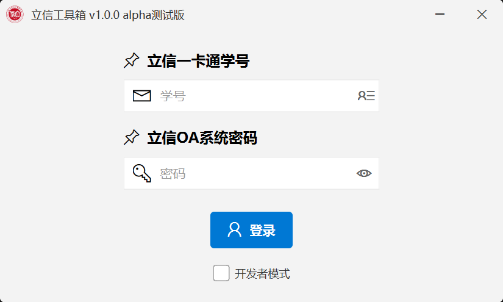
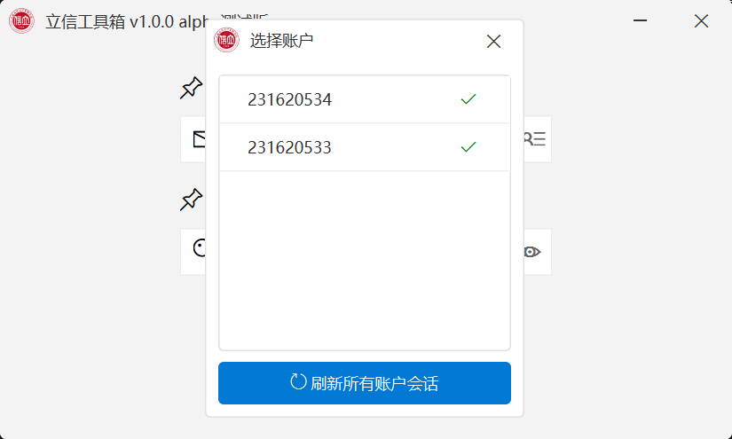
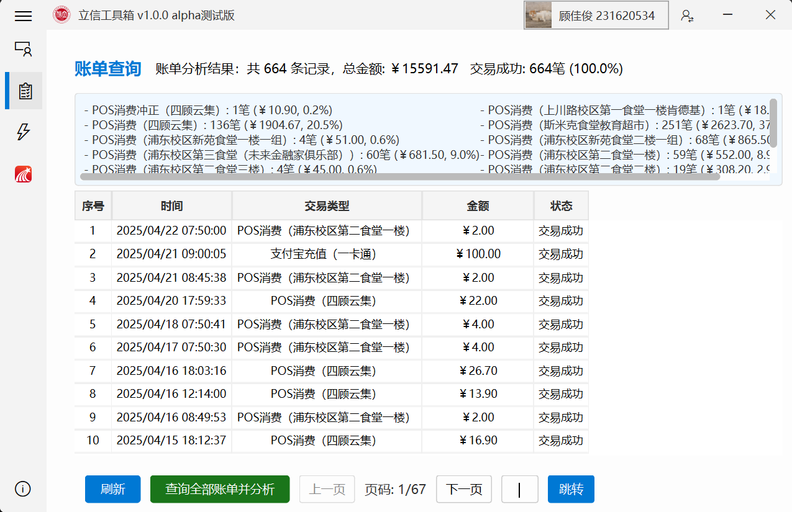
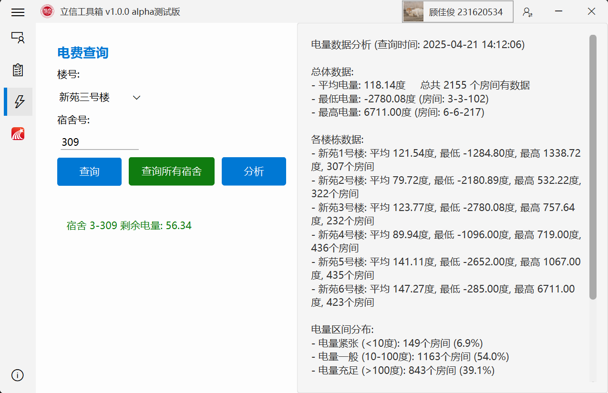

# LiXinTools

LiXinTools是一个基于PySide6的工具集应用程序，专为上海立信立信会计金融学院的学生开发，提供一卡通和学习通服务的便捷访问。

## 联系作者

- **作者**：顾佳俊 上海立信会计金融学院 2023级 金融科技5班
- **微信**：AL-0729-zK
- **电子邮件**：3298732438@qq.com

## 功能特点

- 一卡通服务访问与查询
- 学习通课程管理和通知查看
- 开发者日志模式，方便调试
- 现代化UI界面设计
- 会话管理与自动登录

## 程序截图

### 登录界面


### 多账户管理


### 一卡通功能




## 安装要求

- Python 3.8+
- PySide6
- 其他依赖库（详见requirements.txt）

## 如何使用

1. 克隆仓库
```
git clone https://github.com/F7Pme/LiXinTools.git
```

2. 安装依赖
```
pip install -r requirements.txt
```

3. 运行程序
```
python main.py
```

4. 打包为可执行文件（Windows）
```
build_exe.bat
```

## 项目结构

- `main.py`: 程序入口文件
- `build_exe.bat`: Windows下打包可执行文件的脚本
- `LiXinTools.spec`: PyInstaller打包配置文件
- `requirements.txt`: 项目依赖库列表
- `core/`: 核心功能模块
  - `auth.py`: 认证和会话管理
  - `MainApp.py`: 主应用程序逻辑
  - `display.py`: 显示相关功能
  - `__init__.py`: 包初始化文件
- `gui/`: 图形用户界面组件
  - `BaseWindow.py`: 窗口基类
  - `LoginWindow.py`: 登录窗口
  - `MainWindow.py`: 主窗口
  - `MessageWindow.py`: 消息提示窗口
  - `LoadWindow.py`: 加载窗口
  - `LogWindow.py`: 日志窗口
  - `SideBar.py`: 侧边栏基础组件
  - `SideBar_author.py`: 作者信息侧边栏
  - `SideBar_bill.py`: 账单查询侧边栏
  - `SideBar_electricity.py`: 电费查询侧边栏
  - `SideBar_info.py`: 信息展示侧边栏
  - `SideBar_xxt.py`: 学习通侧边栏
  - `TitleBar.py`: 标题栏组件
  - `styles.py`: UI样式定义
  - `__init__.py`: 包初始化文件
  - `styles/`: 样式资源文件
  - `pic/`: 图片资源文件
- `config/`: 配置文件和数据
  - `config.py`: 应用程序配置
  - `room_data/`: 房间数据
  - `__init__.py`: 包初始化文件
- `utils/`: 工具函数
  - `query_xxt.py`: 学习通查询工具
  - `query_bill.py`: 账单查询工具
  - `query_electricity.py`: 电费查询工具
  - `analysis_bill.py`: 账单分析工具
  - `analysis_electricity.py`: 电费分析工具
  - `data_parser.py`: 数据解析器
  - `__init__.py`: 包初始化文件
- `dist/`: 打包后的可执行文件目录
- `build/`: 构建临时文件目录
- `screenshots/`: 应用程序截图目录
- `Log/`: 日志文件目录
- `cookies/`: 保存的会话数据
- `__pycache__/`: Python缓存文件目录

## 开发者模式

启动时会自动检测开发者模式设置，在开发者模式下会显示日志窗口，方便调试和开发。

## 许可证

[MIT](LICENSE)

## 贡献

欢迎提交问题报告和贡献代码！ 