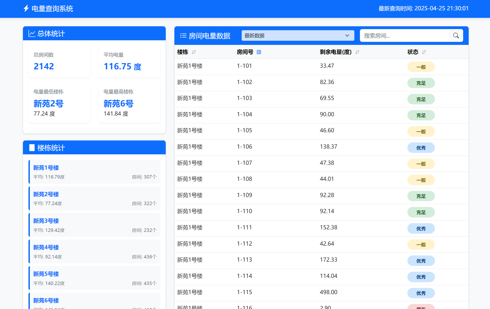

# LiXinTools

LiXinTools是一个基于PySide6的工具集应用程序，专为上海立信立信会计金融学院的学生开发，提供一卡通和学习通服务的便捷访问。

## 联系作者

- **作者**：顾佳俊 上海立信会计金融学院 2023级 金融科技5班
- **微信**：AL-0729-zK
- **电子邮件**：3298732438@qq.com

## 功能特点

- 一卡通服务访问与查询
- 学习通课程管理和通知查看
- 开发者日志模式，方便调试
- 现代化UI界面设计
- 会话管理与自动登录

## 程序截图

### 登录界面


### 多账户管理


### 一卡通功能


### 电量网站



## 安装要求

- Python 3.8+
- PySide6
- 其他依赖库（详见requirements.txt）

## 如何使用

1. 克隆仓库
```
git clone https://github.com/F7Pme/LiXinTools.git
```

2. 安装依赖
```
pip install -r requirements.txt
```

3. 运行程序
```
python main.py
```

4. 打包为可执行文件（Windows）
```
build_exe.bat
```

## 项目结构

- `main.py`: 程序入口文件
- `build_exe.bat`: Windows下打包可执行文件的脚本
- `LiXinTools.spec`: PyInstaller打包配置文件
- `requirements.txt`: 项目依赖库列表
- `core/`: 核心功能模块
  - `auth.py`: 认证和会话管理
  - `__init__.py`: 包初始化文件
- `gui/`: 图形用户界面组件
  - `BaseWindow.py`: 窗口基类
  - `LoginWindow.py`: 登录窗口
  - `MainWindow.py`: 主窗口
  - `MessageWindow.py`: 消息提示窗口
  - `LoadWindow.py`: 加载窗口
  - `LogWindow.py`: 日志窗口
  - `SideBar.py`: 侧边栏基础组件
  - `SideBar_author.py`: 作者信息侧边栏
  - `SideBar_bill.py`: 账单查询侧边栏
  - `SideBar_electricity.py`: 电费查询侧边栏
  - `SideBar_info.py`: 信息展示侧边栏
  - `SideBar_xxt.py`: 学习通侧边栏
  - `TitleBar.py`: 标题栏组件
  - `styles.py`: UI样式定义
  - `__init__.py`: 包初始化文件
  - `styles/`: 样式资源文件
  - `pic/`: 图片资源文件
- `config/`: 配置文件和数据
  - `config.py`: 应用程序配置
  - `room_data/`: 房间数据
  - `__init__.py`: 包初始化文件
- `utils/`: 工具函数
  - `query_xxt.py`: 学习通查询工具
  - `query_bill.py`: 账单查询工具
  - `query_electricity.py`: 电费查询工具
  - `analysis_bill.py`: 账单分析工具
  - `analysis_electricity.py`: 电费分析工具
  - `data_parser.py`: 数据解析器
  - `__init__.py`: 包初始化文件
- `dist/`: 打包后的可执行文件目录
- `build/`: 构建临时文件目录
- `screenshots/`: 应用程序截图目录
- `Log/`: 日志文件目录
- `cookies/`: 保存的会话数据
- `__pycache__/`: Python缓存文件目录
- `Web/`: Web应用目录
  - `app.py`: Flask Web应用
  - `templates/`: HTML模板
  - `static/`: 静态资源文件

## 开发者模式

启动时会自动检测开发者模式设置，在开发者模式下会显示日志窗口，方便调试和开发。

## 许可证

[MIT](LICENSE)

## 贡献

欢迎提交问题报告和贡献代码！ 

---

# 电量查询系统云服务器部署文档

## 部署环境

- 服务器：京东云轻量云主机 (117.72.194.27)
- 操作系统：Ubuntu
- CPU: 2核 内存: 2GB
- 部署目录：/var/www/LiXinTools
- Git仓库：/opt/LiXinTools

## 部署架构

- Web服务：Flask应用 (端口5000)
- 数据库：MySQL (electricity_data)
- 定时任务：crontab (每30分钟执行一次批量查询)
- 服务管理：systemd

## 初始设置步骤

1. 更新系统并安装必要软件包：
```bash
sudo apt update && sudo apt upgrade -y
sudo apt install -y git python3 python3-pip python3-venv mysql-server libmysqlclient-dev build-essential libssl-dev libffi-dev python3-dev cargo rustc
```

2. 创建Git仓库：
```bash
mkdir -p /opt/LiXinTools
cd /opt/LiXinTools
git init --bare
```

3. 设置Git钩子：
```bash
cat > /opt/LiXinTools/hooks/post-receive << 'EOL'
#!/bin/bash
GIT_WORK_TREE=/var/www/LiXinTools git checkout -f main
echo "部署已完成!"
EOL
chmod +x /opt/LiXinTools/hooks/post-receive
```

4. 创建工作目录：
```bash
mkdir -p /var/www/LiXinTools
```

5. 设置MySQL数据库：
```bash
sudo mysql -e "CREATE DATABASE electricity_data;"
sudo mysql -e "CREATE USER 'elecuser'@'localhost' IDENTIFIED WITH mysql_native_password BY '123456';"
sudo mysql -e "GRANT ALL PRIVILEGES ON electricity_data.* TO 'elecuser'@'localhost';"
sudo mysql -e "FLUSH PRIVILEGES;"
```

6. 创建Python虚拟环境：
```bash
cd /var/www/LiXinTools
python3 -m venv venv
source venv/bin/activate
pip config set global.index-url https://pypi.tuna.tsinghua.edu.cn/simple
pip install flask pymysql beautifulsoup4 requests cryptography
```

7. 设置定时任务：
```bash
crontab -e
# 添加以下行：
*/30 * * * * cd /var/www/LiXinTools && /var/www/LiXinTools/venv/bin/python /var/www/LiXinTools/scripts/query_all_rooms.py >> /var/log/electricity_query.log 2>&1
```

8. 创建systemd服务：
```bash
sudo nano /etc/systemd/system/lixintools-web.service
# 添加以下内容：
[Unit]
Description=LiXinTools Web Application
After=network.target

[Service]
User=root
WorkingDirectory=/var/www/LiXinTools
ExecStart=/var/www/LiXinTools/venv/bin/python -m Web.app --host=0.0.0.0
Restart=always
RestartSec=10

[Install]
WantedBy=multi-user.target

# 启用并启动服务
sudo systemctl daemon-reload
sudo systemctl enable lixintools-web
sudo systemctl start lixintools-web
```

9. 开放防火墙端口：
```bash
sudo ufw allow 5000/tcp
```

10. 创建静态文件符号链接：
```bash
cd /var/www/LiXinTools/Web/static
ln -s ../../gui/pic pic
```

## 常用命令

### 服务管理
```bash
# 启动Web服务
sudo systemctl start lixintools-web

# 停止Web服务
sudo systemctl stop lixintools-web

# 重启Web服务
sudo systemctl restart lixintools-web

# 查看服务状态
sudo systemctl status lixintools-web

# 查看服务日志
sudo journalctl -u lixintools-web

# 手动启动Web服务(不使用systemd)
cd /var/www/LiXinTools
source venv/bin/activate
python -m Web.app --host=0.0.0.0
```

### 数据库管理
```bash
# 连接到MySQL
mysql -u elecuser -p123456 electricity_data

# 备份数据库
mysqldump -u elecuser -p123456 electricity_data > /var/backups/electricity_data_$(date +%Y%m%d).sql

# 恢复数据库
mysql -u elecuser -p123456 electricity_data < /var/backups/electricity_data_20250425.sql

# 初始化数据库表
cd /var/www/LiXinTools
source venv/bin/activate
python -c "from utils.query_electricity import ElectricityQuery; query = ElectricityQuery(); query.db_host = 'localhost'; query.db_user = 'elecuser'; query.db_password = '123456'; print(query.init_database())"
```

### 电量查询
```bash
# 手动执行一次全量查询
cd /var/www/LiXinTools
source venv/bin/activate
python scripts/query_all_rooms.py

# 查看定时任务日志
tail -f /var/log/electricity_query.log
```

### Git操作
```bash
# 在本地添加远程仓库
git remote add jdcloud root@117.72.194.27:/opt/LiXinTools

# 推送到服务器
git push jdcloud main
```

### 文件操作
```bash
# 查看Web应用日志
cat /var/www/LiXinTools/web_app.log

# 查看目录结构
ls -la /var/www/LiXinTools

# 编辑配置文件
nano /etc/systemd/system/lixintools-web.service
```

## 故障排除

1. 端口被占用：
```bash
# 查找占用5000端口的进程
netstat -tulpn | grep 5000
# 或者
lsof -i :5000
# 杀死进程
kill <进程ID>
```

2. 数据库连接失败：
```bash
# 检查MySQL是否运行
sudo systemctl status mysql
# 重启MySQL
sudo systemctl restart mysql
# 验证用户权限
sudo mysql -e "SHOW GRANTS FOR 'elecuser'@'localhost';"
```

3. 网站无法访问：
```bash
# 检查防火墙
sudo ufw status
# 如果防火墙启用，确保5000端口开放
sudo ufw allow 5000/tcp
```

4. 定时任务不执行：
```bash
# 检查crontab是否正确设置
crontab -l
# 检查cron服务是否运行
sudo systemctl status cron
# 查看定时任务日志
tail -f /var/log/syslog | grep CRON
``` 